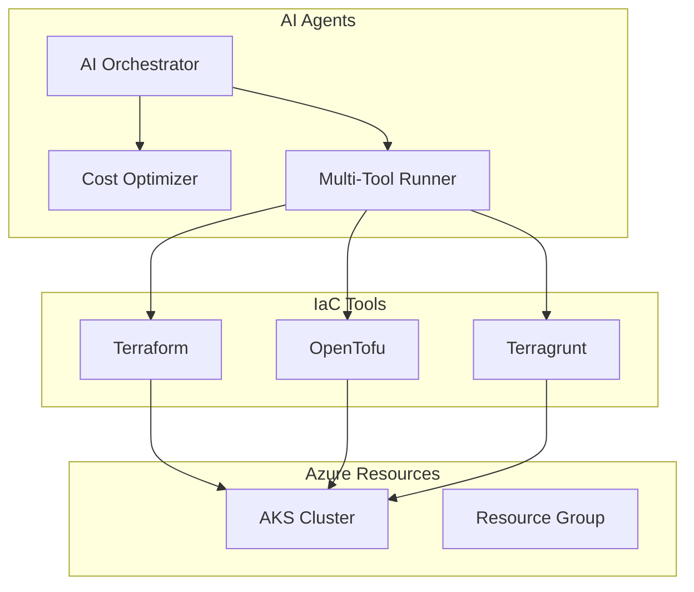
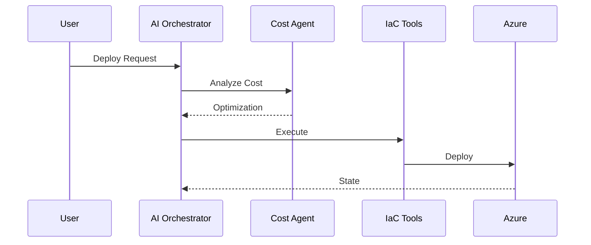

# Azure AKS IaC - Arquitectura AI-Enhanced

## 🎯 Arquitectura Target

### AI Control Plane


### Flujo AI


## 🏗️ Estructura

```
azure-aks-iac/
├── 🤖 ai-agents/
│   ├── orchestrator/main.py       # Coordinador principal
│   └── cost-optimizer/analyzer.py # Optimización de costos
├── ⚙️  orchestration/
│   └── multi-tool-runner.py       # Ejecutor unificado
├── 🌍 environments/dev/
│   ├── main.tf                    # Configuración principal
│   ├── variables.tf               # Variables
│   ├── outputs.tf                 # Outputs
│   └── terraform.tfvars           # Valores
├── 📦 modules/aks/
│   ├── main.tf                    # Módulo AKS con IA
│   ├── variables.tf               # Variables dinámicas
│   └── outputs.tf                 # Outputs con info IA
└── 🔧 scripts/
    ├── ai-orchestrator.sh         # Script principal IA
    ├── deploy.sh                  # Despliegue tradicional
    ├── prerequisites.sh           # Instalación
    ├── check-prerequisites.sh     # Verificación
    └── destroy.sh                 # Limpieza
```

## 🤖 Componentes IA

### 1. AI Orchestrator
- **Función**: Coordinación inteligente
- **Algoritmo**: Análisis de contexto + selección de herramientas
- **Output**: Recomendaciones optimizadas

### 2. Cost Optimizer
- **Función**: Optimización automática 24/7
- **Algoritmo**: Patrones de uso + predicción de costos
- **Output**: Configuración de mínimo costo

### 3. Multi-Tool Runner
- **Función**: Ejecutor unificado
- **Algoritmo**: Selección inteligente de herramientas
- **Output**: Despliegue con herramienta óptima

## 💰 Optimización Dinámica

| Horario | VM Size | Costo/mes | Uso |
|---------|---------|-----------|-----|
| Off-hours (19:00-08:59) | Standard_B1s | $15-20 | Mínimo |
| Business (09:00-18:59) | Standard_B2s | $25-35 | Activo |

**Ahorro**: 20-40% vs configuración estática

## 🔄 Roadmap

### ✅ Fase 1: AI Foundation
- AI Orchestrator
- Cost Optimizer
- Multi-Tool Runner

### 🔄 Fase 2: Intelligence Layer
- Security Agent
- Drift Detection
- Policy Engine

### 🔮 Fase 3: Enterprise
- Multi-environment
- Observability
- Auto-remediation
