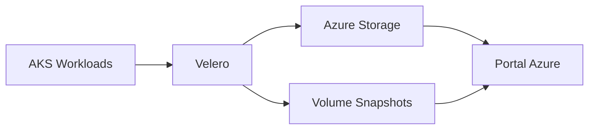

# 🛡️ Backup AKS - Referencia Rápida

## 🚀 Configuración Completa
```bash
./scripts/complete-backup-setup.sh
```

## 🔍 Validación y Métricas
```bash
# Validación completa
./scripts/validate-azure-native-backup.sh

# Métricas detalladas
./scripts/backup-metrics.sh
```

## 🔄 Reintento Portal (si es necesario)
```bash
./scripts/retry-backup-instance.sh
```

## 📚 Documentación Completa
- `docs/backup-complete-guide.md` - Guía única con diagramas Mermaid

## 🏗️ Arquitectura Visual


## 🌐 Portal Azure
https://portal.azure.com/#@edtech.com.co/resource/subscriptions/617fad55-504d-42d2-ba0e-267e8472a399/resourceGroups/rg-aks-demo-dev/providers/Microsoft.ContainerService/managedclusters/aks-aks-demo-dev/backup

## 🔧 Comandos Útiles

### Ver backups:
```bash
kubectl get backup.velero.io -n dataprotection-microsoft
```

### Crear backup manual:
```bash
kubectl apply -f - <<EOF
apiVersion: velero.io/v1
kind: Backup
metadata:
  name: manual-backup-$(date +%Y%m%d-%H%M%S)
  namespace: dataprotection-microsoft
spec:
  includedNamespaces: ["default"]
  storageLocation: default
  ttl: 168h0m0s
  snapshotVolumes: true
EOF
```

### Ver schedules:
```bash
kubectl get schedules -n dataprotection-microsoft
```

## 💰 Costos
- **Estimado**: $5-15/mes
- **Componentes**: Storage Account + Backup Storage + Volume Snapshots
