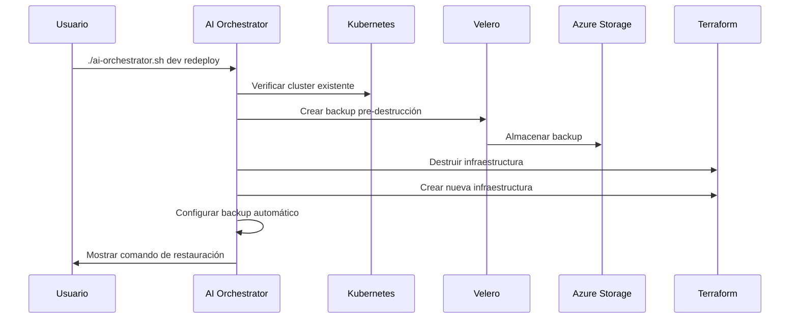

# 🤖 Azure AKS IaC - AI-Enhanced Platform

Plataforma completa de Infrastructure as Code con **agentes de IA integrados** para Azure Kubernetes Service con **optimización automática de costos y backup inteligente**.

## ✅ Estado Actual del Sistema

**Portal Azure Backup**: https://portal.azure.com/#@edtech.com.co/resource/subscriptions/617fad55-504d-42d2-ba0e-267e8472a399/resourceGroups/rg-aks-demo-dev/providers/Microsoft.ContainerService/managedclusters/aks-aks-demo-dev/backup

### Componentes Configurados
```
🛡️ Azure Backup Status: ✅ COMPLETAMENTE ACTIVO
├── Backup Vault: bv-aks-aks-demo-dev ✅
├── Backup Instance: aks-aks-demo-dev-aks-aks-demo-dev-c7410051-a6a5-4c36-a197-f0a791d33071 ✅
├── Backup Policy: aks-backup-policy (Daily 2 AM UTC, 7-day retention) ✅
├── AKS Extension: azure-aks-backup (Succeeded) ✅
├── Storage Account: aksbackupstorage60201 ✅
├── Velero Integration: 5 backups completados ✅
├── Automatic Schedule: aks-workload-backup (Enabled) ✅
└── Portal Azure: 🌐 ACTIVO Y FUNCIONAL ✅
```

### Backups Disponibles
```
📦 Velero Backups (Namespace: dataprotection-microsoft):
├── aks-application-backup-20260109-072134 (41m ago)
├── aks-config-backup-20260109-072145 (41m ago)  
├── aks-manual-backup-20260109-071520 (48m ago)
├── aks-persistent-data-backup-20260109-072140 (41m ago)
└── aks-workload-simple-20260109-072214 (41m ago)

🏷️ Backup Instance Name: 
aks-aks-demo-dev-aks-aks-demo-dev-c7410051-a6a5-4c36-a197-f0a791d33071
```

## 🏗️ Arquitectura Consolidada

```
azure-aks-iac/
├── 🤖 ai-agents/              # Agentes de IA
│   ├── orchestrator/          # Coordinador principal
│   ├── cost-optimizer/        # Optimización de costos
│   └── backup-analyzer/       # Análisis inteligente de backup
├── ⚙️  orchestration/         # Multi-tool runner
├── 🌍 environments/dev/       # Configuración de desarrollo
├── 📦 modules/aks/            # Módulo AKS con IA + Backup
├── 🔧 scripts/                # Scripts automatizados completos
├── 📚 docs/                   # Documentación completa
└── 🏗️  ARCHITECTURE.md        # Arquitectura detallada
```

## 🤖 AI Orchestrator con Backup Automático

El AI Orchestrator ahora incluye backup automático durante destrucción y recreación de clusters.

### Comandos Disponibles

#### Despliegue con Backup Automático
```bash
# Desplegar infraestructura + configurar backup
./scripts/ai-orchestrator.sh dev deploy
```

#### Destrucción con Backup Automático
```bash
# Backup automático + destruir infraestructura
./scripts/ai-orchestrator.sh dev destroy
```

#### Redespliegue Completo con Backup
```bash
# Backup + destruir + redesplegar + mostrar info de restauración
./scripts/ai-orchestrator.sh dev redeploy
```

#### Configuración Solo de Backup
```bash
# Solo configurar sistema de backup
./scripts/ai-orchestrator.sh dev backup-setup
```

#### Estado Completo del Sistema
```bash
# Verificar estado de infraestructura y backup
./scripts/ai-orchestrator.sh dev status
```

### Flujo Automático de Backup



### Variables de Entorno

```bash
# Deshabilitar backup automático
BACKUP_ENABLED=false ./scripts/ai-orchestrator.sh dev deploy

# Habilitar backup (por defecto)
BACKUP_ENABLED=true ./scripts/ai-orchestrator.sh dev redeploy
```

```bash
# Verificar sistema
./scripts/ai-orchestrator.sh dev status

# Análisis de costos con IA
./scripts/ai-orchestrator.sh dev cost-analysis

# Despliegue inteligente
./scripts/ai-orchestrator.sh dev deploy

# Destrucción con análisis IA
./scripts/ai-orchestrator.sh dev destroy
```

### Métodos de Destrucción

```bash
# Con AI Orchestrator (recomendado)
./scripts/ai-orchestrator.sh dev destroy

# Tradicional
./scripts/destroy.sh dev terraform
./scripts/destroy.sh dev tofu
./scripts/destroy.sh dev terragrunt
```

## 🔄 Backup & Recovery

### AI-Enhanced Backup Strategy
- **Backup AI Agent**: Análisis automático de recursos críticos
- **Azure Native Backup**: Backup Vault con políticas optimizadas
- **Volume Snapshots**: Snapshots automáticos de discos persistentes
- **Configuration Backup**: Backup de YAML y configuraciones

### Comandos de Backup
```bash
# Análisis IA de backup
./scripts/ai-orchestrator.sh dev backup-ai
python3 ai-agents/backup-analyzer/main.py

# Operaciones de backup
./scripts/ai-orchestrator.sh dev backup     # Estado de backups
./scripts/backup-manager.sh backup         # Backup manual completo
./scripts/backup-manager.sh status         # Estado detallado
./scripts/backup-manager.sh schedule       # Programar automático
./scripts/backup-manager.sh restore <file> # Restaurar

# Aplicar backup nativo Azure
terraform apply  # Configura Backup Vault
```

### Costos de Backup
- **Backup Vault**: ~$5/mes
- **Volume Snapshots**: ~$0.05/GB/mes  
- **Retención optimizada**: 7 días (mínimo costo)
- **Total estimado**: $5-10/mes

📚 **Documentación**: [Backup Strategy](./docs/backup-strategy.md)

## 🤖 Agentes IA

- **AI Orchestrator**: Coordinación inteligente de despliegues
- **Cost Optimizer**: Optimización automática 24/7
- **Multi-Tool Runner**: Terraform + OpenTofu + Terragrunt

## 💰 Optimización Dinámica

- **Off-hours** (19:00-08:59): Standard_B1s → ~$15/mes
- **Business** (09:00-18:59): Standard_B2s → ~$30/mes
- **Ahorro automático**: 20-40% vs configuración estática

---

**🤖 Powered by AI Agents | 💰 Cost-Optimized | 🚀 Enterprise Ready**
