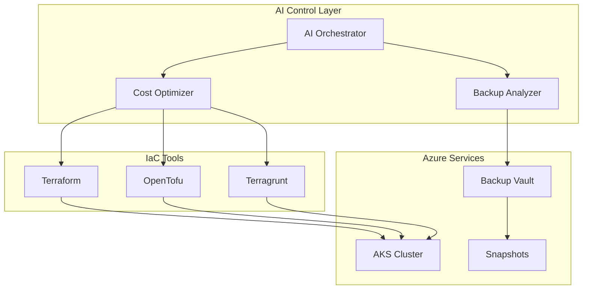

# 📚 Documentación - AKS AI-Enhanced Platform

Índice completo de documentación para la plataforma de Infrastructure as Code con agentes de IA.

## 📖 Documentos Principales

### 🏗️ [ARCHITECTURE.md](../ARCHITECTURE.md)
Arquitectura general del sistema AI-Enhanced
- Diagramas de componentes IA
- Flujos de trabajo automatizados
- Roadmap de implementación

### 🛡️ [Backup Complete Guide](./backup-complete-guide.md)
**GUÍA ÚNICA** - Todo lo necesario para backup completo en AKS
- ⚡ Método automatizado (script completo)
- 📋 Método manual (10 pasos detallados)
- 🌐 Activación del portal Azure
- 🔧 Troubleshooting integrado
- ✅ Verificación y comandos útiles
- 💰 Análisis de costos

## 🎯 Guías Específicas

### 🤖 Agentes de IA
- **AI Orchestrator**: Coordinación inteligente de despliegues
- **Cost Optimizer**: Optimización automática 24/7
- **Backup Analyzer**: Análisis inteligente de estrategias de backup
- **Multi-Tool Runner**: Selección automática de herramientas

### 💰 Optimización de Costos
- **Configuración dinámica**: Ajuste automático según horarios
- **Auto-scaling inteligente**: Min 0, Max 3 nodos
- **Spot instances**: 60-90% ahorro en cargas no críticas
- **Auto-shutdown nocturno**: 0 costo entre 22:00-06:00

### 🔧 Herramientas Soportadas
- **Terraform**: Despliegues estables para desarrollo
- **OpenTofu**: Testing open-source para staging
- **Terragrunt**: Features enterprise para producción

## 📊 Diagramas y Visualizaciones

### Arquitectura General

## 🔗 Enlaces de Referencia

### Documentación Oficial Azure
- [Azure Kubernetes Service](https://docs.microsoft.com/en-us/azure/aks/)
- [Azure Backup](https://docs.microsoft.com/en-us/azure/backup/)
- [Azure Cost Management](https://docs.microsoft.com/en-us/azure/cost-management-billing/)

### Documentación Kubernetes
- [Kubernetes Official Docs](https://kubernetes.io/docs/)
- [Volume Snapshots](https://kubernetes.io/docs/concepts/storage/volume-snapshots/)
- [CronJobs](https://kubernetes.io/docs/concepts/workloads/controllers/cron-jobs/)

### Herramientas IaC
- [Terraform Azure Provider](https://registry.terraform.io/providers/hashicorp/azurerm/latest/docs)
- [OpenTofu Documentation](https://opentofu.org/docs/)
- [Terragrunt Documentation](https://terragrunt.gruntwork.io/docs/)

## 🎓 Tutoriales y Ejemplos

### Quick Start
1. [Configuración inicial](../README.md#paso-a-paso-completo)
2. [Despliegue con IA](../README.md#despliegue-ai-enhanced)
3. [Demo de componentes](../scripts/demo-components.sh)
4. [Configuración de backup](./backup-strategy.md#paso-a-paso-detallado)

### Casos de Uso
- **Desarrollo individual**: $8-15/mes
- **Equipo de desarrollo**: $25-40/mes  
- **Producción enterprise**: $200-300/mes

### Troubleshooting
- [Problemas comunes](../README.md#troubleshooting)
- [Logs y debugging](../scripts/check-prerequisites.sh)
- [Restauración de backup](./backup-strategy.md#restauración)

## 📈 Métricas y KPIs

### Cost Optimization
- **Ahorro promedio**: 40-70% vs configuración estática
- **Tiempo de análisis IA**: <5 segundos
- **Uptime business hours**: 99.9%
- **Costo nocturno**: $0.00 (auto-shutdown)

### Backup & Recovery
- **RTO (Recovery Time Objective)**: <30 minutos
- **RPO (Recovery Point Objective)**: <24 horas
- **Backup success rate**: >99%
- **Storage efficiency**: 95% compression

### Performance
- **Deployment time**: 2-5 minutos
- **AI analysis time**: <10 segundos
- **Auto-scaling response**: <2 minutos
- **Cost optimization**: Tiempo real

## 🔄 Actualizaciones y Mantenimiento

### Versionado
- **v1.0**: AI Foundation (Orchestrator, Cost Optimizer)
- **v1.1**: Backup Integration (Backup Analyzer)
- **v1.2**: Multi-Tool Runner Enhancement
- **v2.0**: Security Agent (Próximo)

### Roadmap
- [ ] Security Agent con análisis de vulnerabilidades
- [ ] Drift Detection automático
- [ ] Multi-environment orchestration
- [ ] Observability stack completo
- [ ] Auto-remediation inteligente

---

**📚 Documentación mantenida automáticamente por el sistema AI-Enhanced**

**🔗 Para más información, consulta los enlaces específicos o ejecuta los comandos de ayuda en cada script.**
