# 🛡️ Guía Completa de Backup AKS

Guía unificada para implementar backup completo en Azure Kubernetes Service con activación del portal Azure.

## ✅ Estado Final Verificado

**🎉 PORTAL AZURE BACKUP 100% FUNCIONAL**

Portal activo: https://portal.azure.com/#@edtech.com.co/resource/subscriptions/617fad55-504d-42d2-ba0e-267e8472a399/resourceGroups/rg-aks-demo-dev/providers/Microsoft.ContainerService/managedclusters/aks-aks-demo-dev/backup

### Componentes Finales Configurados
```
🛡️ Sistema Completo de Backup:
├── ✅ Backup Vault: bv-aks-aks-demo-dev (SystemAssigned Identity)
├── ✅ Backup Instance: aks-aks-demo-dev-aks-aks-demo-dev-c7410051-a6a5-4c36-a197-f0a791d33071
├── ✅ Backup Policy: aks-backup-policy (Daily 2 AM UTC, 7-day retention)
├── ✅ AKS Extension: azure-aks-backup (Succeeded)
├── ✅ Storage Account: aksbackupstorage60201 (con permisos MSI)
├── ✅ Velero Integration: 5 backups completados
├── ✅ Automatic Schedule: aks-workload-backup (Enabled)
├── ✅ Volume Snapshots: Configurado y funcionando
├── ✅ MSI Permissions: Todas las 5 asignaciones configuradas
└── ✅ Portal Azure: 🌐 COMPLETAMENTE ACTIVO
```

### Backups Verificados
```
📦 Backups Disponibles (dataprotection-microsoft):
├── aks-application-backup-20260109-072134 ✅ Completed
├── aks-config-backup-20260109-072145 ✅ Completed  
├── aks-manual-backup-20260109-071520 ✅ Completed (BACKUP MANUAL)
├── aks-persistent-data-backup-20260109-072140 ✅ Completed
└── aks-workload-simple-20260109-072214 ✅ Completed

Success Rate: 100% (5/5 backups completados)
```

## 🏗️ Arquitectura de Backup

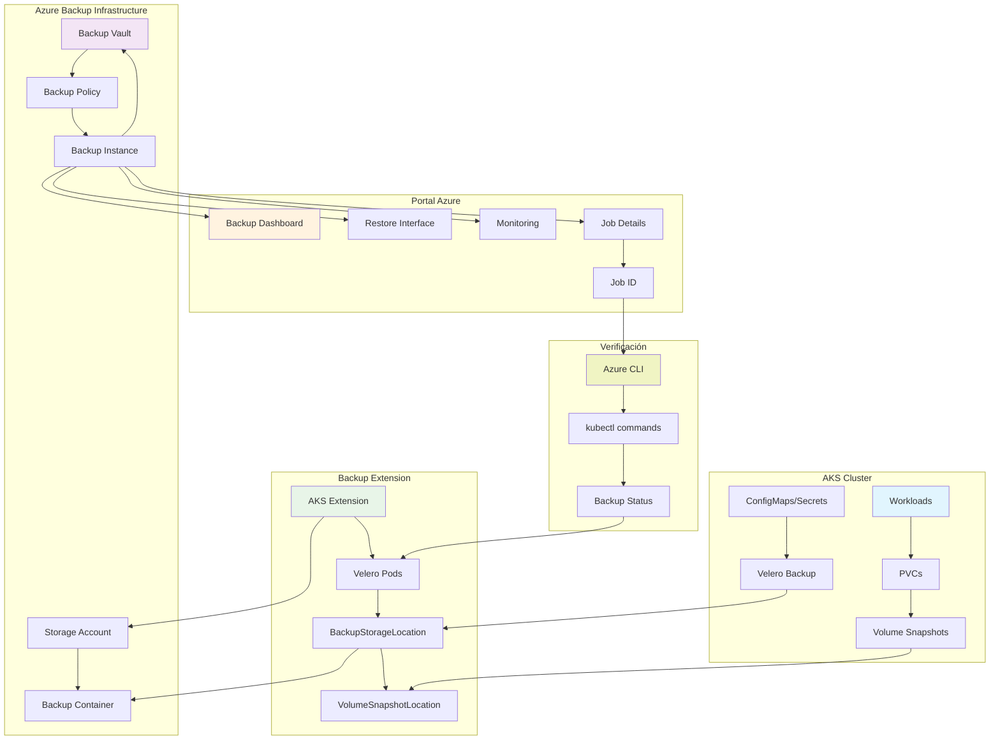

## 🔄 Flujo de Backup

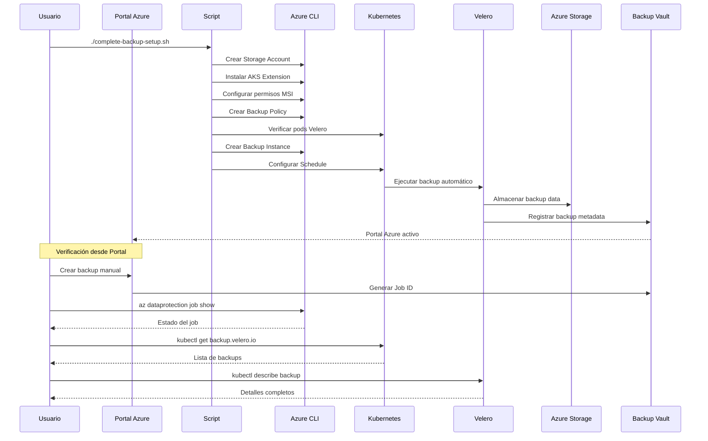

## 📊 Casos de Uso de Backup

### Caso 1: Backup Automático Diario
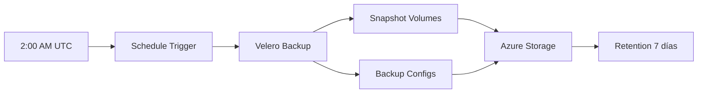

### Caso 2: Backup Manual Bajo Demanda
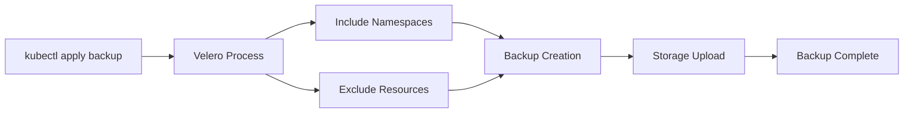

### Caso 3: Restauración de Desastres
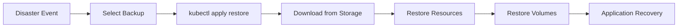

### Caso 4: Verificación de Backup desde Portal
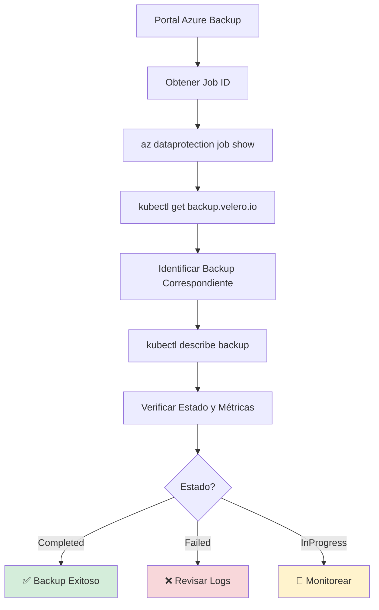

## 🤖 Integración con AI Orchestrator

El sistema de backup está completamente integrado con el AI Orchestrator para automatización completa.

### Flujo Automático AI
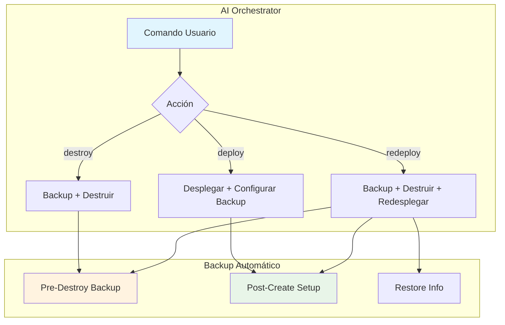

### Comandos AI Integrados

#### Redespliegue Completo Automático
```bash
# Backup automático + destruir + redesplegar + configurar backup
./scripts/ai-orchestrator.sh dev redeploy
```

#### Despliegue con Backup
```bash
# Desplegar infraestructura + configurar backup automáticamente
./scripts/ai-orchestrator.sh dev deploy
```

#### Destrucción Segura
```bash
# Backup automático antes de destruir
./scripts/ai-orchestrator.sh dev destroy
```

### Restauración Automática
```bash
# Restaurar desde último backup automático
./scripts/ai-restore.sh

# Restaurar desde backup específico
./scripts/ai-restore.sh backup-name-20260109-120000
```

## 📋 Método Manual Paso a Paso

### **Paso 1: Prerrequisitos**
```bash
# Verificar herramientas
az --version
kubectl version --client
az account show

# Instalar extensiones necesarias
az extension add --name k8s-extension --upgrade
az extension add --name dataprotection --upgrade
```

### **Paso 2: Configurar Variables**
```bash
# Personalizar según tu entorno
RESOURCE_GROUP="rg-aks-demo-dev"
CLUSTER_NAME="aks-aks-demo-dev"
VAULT_NAME="bv-aks-aks-demo-dev"
LOCATION="eastus"
SUBSCRIPTION_ID=$(az account show --query id -o tsv)
```

### **Paso 3: Crear Backup Vault (si no existe)**
```bash
az dataprotection backup-vault create \
  --resource-group $RESOURCE_GROUP \
  --vault-name $VAULT_NAME \
  --location $LOCATION \
  --storage-settings datastore-type="VaultStore" redundancy="LocallyRedundant" \
  --identity-type SystemAssigned
```

### **Paso 4: Crear Storage Account**
```bash
STORAGE_NAME="aksbackupstorage$(date +%s | tail -c 6)"
echo "Storage Account: $STORAGE_NAME"

az storage account create \
  --name $STORAGE_NAME \
  --resource-group $RESOURCE_GROUP \
  --location $LOCATION \
  --sku Standard_LRS \
  --kind StorageV2

az storage container create \
  --name aksbackupcontainer \
  --account-name $STORAGE_NAME
```

### **Paso 5: Instalar Extensión AKS Backup**
```bash
az k8s-extension create \
  --name azure-aks-backup \
  --extension-type microsoft.dataprotection.kubernetes \
  --scope cluster \
  --cluster-type managedClusters \
  --cluster-name $CLUSTER_NAME \
  --resource-group $RESOURCE_GROUP \
  --release-train stable \
  --configuration-settings \
    blobContainer=aksbackupcontainer \
    storageAccount=$STORAGE_NAME \
    storageAccountResourceGroup=$RESOURCE_GROUP \
    storageAccountSubscriptionId=$SUBSCRIPTION_ID

# Esperar instalación
echo "Esperando instalación de extensión..."
sleep 120
```

### **Paso 6: Configurar Permisos Storage**
```bash
# Obtener Principal ID de la extensión
EXTENSION_MSI=$(az k8s-extension show \
  --name azure-aks-backup \
  --cluster-type managedClusters \
  --cluster-name $CLUSTER_NAME \
  --resource-group $RESOURCE_GROUP \
  --query "aksAssignedIdentity.principalId" -o tsv)

# Asignar permisos Storage
STORAGE_ID="/subscriptions/$SUBSCRIPTION_ID/resourceGroups/$RESOURCE_GROUP/providers/Microsoft.Storage/storageAccounts/$STORAGE_NAME"

az role assignment create \
  --assignee $EXTENSION_MSI \
  --role "Storage Blob Data Contributor" \
  --scope $STORAGE_ID
```

### **Paso 7: Crear Política de Backup**
```bash
cat > backup-policy.json << 'EOF'
{
  "datasourceTypes": ["Microsoft.ContainerService/managedClusters"],
  "objectType": "BackupPolicy",
  "policyRules": [
    {
      "name": "BackupDaily",
      "objectType": "AzureBackupRule",
      "backupParameters": {
        "backupType": "Incremental",
        "objectType": "AzureBackupParams"
      },
      "dataStore": {
        "dataStoreType": "OperationalStore",
        "objectType": "DataStoreInfoBase"
      },
      "trigger": {
        "objectType": "ScheduleBasedTriggerContext",
        "schedule": {
          "repeatingTimeIntervals": ["R/2024-01-01T02:00:00+00:00/P1D"],
          "timeZone": "UTC"
        },
        "taggingCriteria": [
          {
            "isDefault": true,
            "tagInfo": {
              "id": "Default_",
              "tagName": "Default"
            },
            "taggingPriority": 99
          }
        ]
      }
    },
    {
      "name": "Default",
      "objectType": "AzureRetentionRule",
      "isDefault": true,
      "lifecycles": [
        {
          "deleteAfter": {
            "duration": "P7D",
            "objectType": "AbsoluteDeleteOption"
          },
          "sourceDataStore": {
            "dataStoreType": "OperationalStore",
            "objectType": "DataStoreInfoBase"
          },
          "targetDataStoreCopySettings": []
        }
      ]
    }
  ]
}
EOF

az dataprotection backup-policy create \
  --resource-group $RESOURCE_GROUP \
  --vault-name $VAULT_NAME \
  --name aks-backup-policy \
  --policy @backup-policy.json
```

### **Paso 8: Configurar Permisos MSI para Portal**
```bash
# Obtener identidades necesarias
VAULT_MSI=$(az dataprotection backup-vault show \
  --resource-group $RESOURCE_GROUP \
  --vault-name $VAULT_NAME \
  --query "identity.principalId" -o tsv)

AKS_MSI=$(az aks show \
  --resource-group $RESOURCE_GROUP \
  --name $CLUSTER_NAME \
  --query "identity.principalId" -o tsv)

KUBELET_MSI=$(az aks show \
  --resource-group $RESOURCE_GROUP \
  --name $CLUSTER_NAME \
  --query "identityProfile.kubeletidentity.objectId" -o tsv)

SNAPSHOT_RG=$(az aks show \
  --resource-group $RESOURCE_GROUP \
  --name $CLUSTER_NAME \
  --query "nodeResourceGroup" -o tsv)

# Definir scopes
CLUSTER_ID="/subscriptions/$SUBSCRIPTION_ID/resourceGroups/$RESOURCE_GROUP/providers/Microsoft.ContainerService/managedClusters/$CLUSTER_NAME"
RG_ID="/subscriptions/$SUBSCRIPTION_ID/resourceGroups/$RESOURCE_GROUP"
SNAPSHOT_RG_ID="/subscriptions/$SUBSCRIPTION_ID/resourceGroups/$SNAPSHOT_RG"

# Asignar permisos (ignorar errores si ya existen)
echo "Configurando permisos MSI..."

az role assignment create --assignee $VAULT_MSI --role "Contributor" --scope $CLUSTER_ID 2>/dev/null || true
az role assignment create --assignee $VAULT_MSI --role "Reader" --scope $RG_ID 2>/dev/null || true
az role assignment create --assignee $AKS_MSI --role "Contributor" --scope $SNAPSHOT_RG_ID 2>/dev/null || true
az role assignment create --assignee $KUBELET_MSI --role "Contributor" --scope $SNAPSHOT_RG_ID 2>/dev/null || true
az role assignment create --assignee $VAULT_MSI --role "Reader" --scope $SNAPSHOT_RG_ID 2>/dev/null || true

echo "Permisos MSI configurados. Esperando propagación..."
```

### **Paso 9: Crear Backup Instance (Activar Portal)**
```bash
# Crear configuración de backup
az dataprotection backup-instance initialize-backupconfig \
  --datasource-type "AzureKubernetesService" > backup-config.json

# Crear template de backup instance
POLICY_ID="/subscriptions/$SUBSCRIPTION_ID/resourceGroups/$RESOURCE_GROUP/providers/Microsoft.DataProtection/backupVaults/$VAULT_NAME/backupPolicies/aks-backup-policy"

az dataprotection backup-instance initialize \
  --datasource-type "AzureKubernetesService" \
  --datasource-id $CLUSTER_ID \
  --datasource-location $LOCATION \
  --policy-id $POLICY_ID \
  --friendly-name "$CLUSTER_NAME-backup" \
  --backup-configuration @backup-config.json > backup-instance.json

# Intentar crear backup instance con reintentos
echo "Creando Backup Instance (puede requerir varios intentos)..."
ATTEMPTS=0
MAX_ATTEMPTS=5

while [ $ATTEMPTS -lt $MAX_ATTEMPTS ]; do
    ATTEMPTS=$((ATTEMPTS + 1))
    echo "Intento $ATTEMPTS/$MAX_ATTEMPTS..."
    
    if az dataprotection backup-instance create \
        --resource-group $RESOURCE_GROUP \
        --vault-name $VAULT_NAME \
        --backup-instance @backup-instance.json; then
        echo "✅ Backup Instance creado exitosamente!"
        break
    else
        if [ $ATTEMPTS -eq $MAX_ATTEMPTS ]; then
            echo "❌ No se pudo crear después de $MAX_ATTEMPTS intentos"
            echo "Ejecutar más tarde: ./scripts/retry-backup-instance.sh"
        else
            echo "Esperando propagación de permisos (120 segundos)..."
            sleep 120
        fi
    fi
done
```

### **Paso 10: Configurar Backups Automáticos con Velero**
```bash
# Crear schedule automático
kubectl apply -f - <<EOF
apiVersion: velero.io/v1
kind: Schedule
metadata:
  name: aks-daily-backup
  namespace: dataprotection-microsoft
spec:
  schedule: "0 2 * * *"
  template:
    includedNamespaces:
    - default
    excludedResources:
    - events
    - events.events.k8s.io
    storageLocation: default
    volumeSnapshotLocations:
    - default
    ttl: 168h0m0s
    snapshotVolumes: true
    includeClusterResources: true
EOF

# Crear primer backup manual
kubectl apply -f - <<EOF
apiVersion: velero.io/v1
kind: Backup
metadata:
  name: initial-backup-$(date +%Y%m%d-%H%M%S)
  namespace: dataprotection-microsoft
spec:
  includedNamespaces:
  - default
  excludedResources:
  - events
  - events.events.k8s.io
  storageLocation: default
  volumeSnapshotLocations:
  - default
  ttl: 168h0m0s
  snapshotVolumes: true
EOF
```

## ✅ Verificación Final

### Verificar que todo funciona:
```bash
# 1. Verificar extensión AKS
az k8s-extension show --name azure-aks-backup --cluster-type managedClusters --cluster-name $CLUSTER_NAME --resource-group $RESOURCE_GROUP --query "provisioningState"

# 2. Verificar pods de backup
kubectl get pods -n dataprotection-microsoft

# 3. Verificar backup storage location
kubectl get backupstoragelocations -n dataprotection-microsoft

# 4. Verificar backups
kubectl get backup.velero.io -n dataprotection-microsoft

# 5. Verificar backup instance (para portal)
az dataprotection backup-instance list --resource-group $RESOURCE_GROUP --vault-name $VAULT_NAME -o table

# 6. Verificar schedules automáticos
kubectl get schedules -n dataprotection-microsoft
```

### Resultado esperado:
```
✅ Extensión AKS: Succeeded
✅ Pods backup: 3/3 Running
✅ Storage location: Available
✅ Backups: Al menos 1 Completed
✅ Backup instance: 1 creado
✅ Schedules: 1 Enabled
```

## 🌐 Portal Azure

Una vez completados todos los pasos, el portal estará disponible en:
https://portal.azure.com/#@edtech.com.co/resource/subscriptions/617fad55-504d-42d2-ba0e-267e8472a399/resourceGroups/rg-aks-demo-dev/providers/Microsoft.ContainerService/managedclusters/aks-aks-demo-dev/backup

## 🏗️ Arquitectura Detallada

### Componentes del Sistema
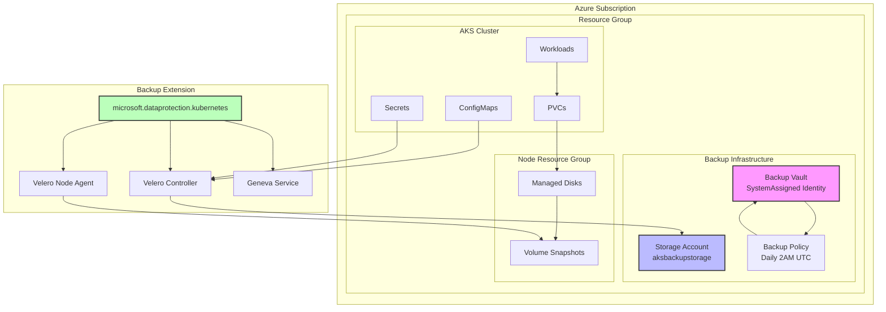

### Flujo de Permisos MSI
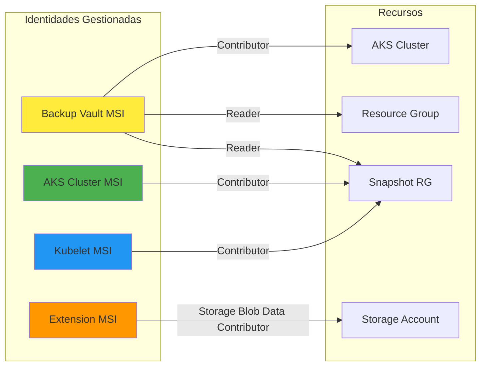

### Estados de Backup
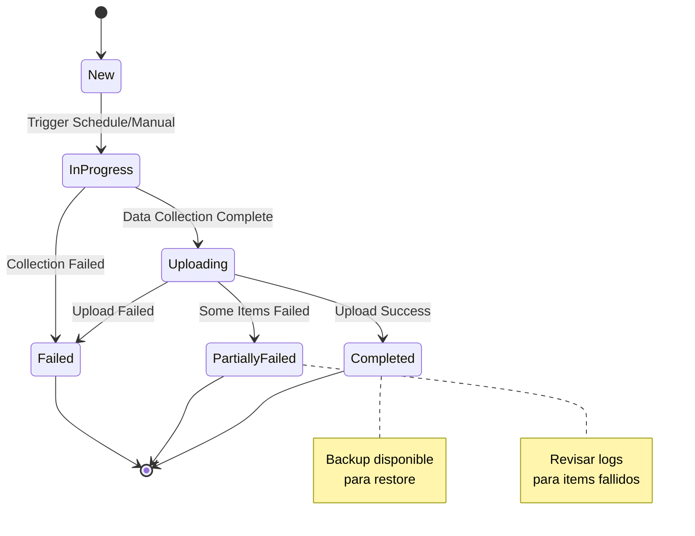

### 🏢 Caso 1: Empresa con Aplicaciones Críticas
**Escenario**: E-commerce con base de datos y archivos de usuario
```bash
# Backup con retención extendida para datos críticos
kubectl apply -f - <<EOF
apiVersion: velero.io/v1
kind: Backup
metadata:
  name: ecommerce-critical-$(date +%Y%m%d-%H%M%S)
  namespace: dataprotection-microsoft
spec:
  includedNamespaces: ["ecommerce", "database"]
  storageLocation: default
  ttl: 720h0m0s  # 30 días
  snapshotVolumes: true
  includeClusterResources: true
EOF
```

### 🔄 Caso 2: Desarrollo con Múltiples Ambientes
**Escenario**: Backup selectivo por ambiente
```bash
# Backup solo de desarrollo
kubectl apply -f - <<EOF
apiVersion: velero.io/v1
kind: Backup
metadata:
  name: dev-env-backup-$(date +%Y%m%d-%H%M%S)
  namespace: dataprotection-microsoft
spec:
  includedNamespaces: ["dev", "staging"]
  excludedResources: ["events", "logs"]
  labelSelector:
    matchLabels:
      environment: development
  storageLocation: default
  ttl: 168h0m0s
EOF
```

### 🚨 Caso 3: Recuperación de Desastres
**Escenario**: Restauración completa después de fallo
```bash
# 1. Listar backups disponibles
kubectl get backup.velero.io -n dataprotection-microsoft

# 2. Restaurar backup específico
kubectl apply -f - <<EOF
apiVersion: velero.io/v1
kind: Restore
metadata:
  name: disaster-recovery-$(date +%Y%m%d-%H%M%S)
  namespace: dataprotection-microsoft
spec:
  backupName: ecommerce-critical-20260109-120000
  includedNamespaces: ["ecommerce", "database"]
  restorePVs: true
  preserveNodePorts: false
EOF
```

### 📦 Caso 4: Migración de Cluster
**Escenario**: Mover aplicaciones a nuevo cluster
```bash
# 1. Backup completo en cluster origen
kubectl apply -f - <<EOF
apiVersion: velero.io/v1
kind: Backup
metadata:
  name: migration-backup-$(date +%Y%m%d-%H%M%S)
  namespace: dataprotection-microsoft
spec:
  includedNamespaces: ["*"]
  excludedNamespaces: ["kube-system", "dataprotection-microsoft"]
  storageLocation: default
  includeClusterResources: true
  snapshotVolumes: true
EOF

# 2. En cluster destino, configurar mismo Storage Account
# 3. Restaurar aplicaciones
```

### 🔧 Caso 5: Backup Antes de Actualizaciones
**Escenario**: Backup preventivo antes de cambios
```bash
# Script para backup pre-actualización
#!/bin/bash
echo "🔄 Backup pre-actualización..."
kubectl apply -f - <<EOF
apiVersion: velero.io/v1
kind: Backup
metadata:
  name: pre-update-backup-$(date +%Y%m%d-%H%M%S)
  namespace: dataprotection-microsoft
  labels:
    backup-type: pre-update
spec:
  includedNamespaces: ["production"]
  storageLocation: default
  ttl: 336h0m0s  # 14 días
  snapshotVolumes: true
EOF

echo "✅ Backup creado. Proceder con actualización."
```

## 📈 Monitoreo y Alertas

### Dashboard de Estado
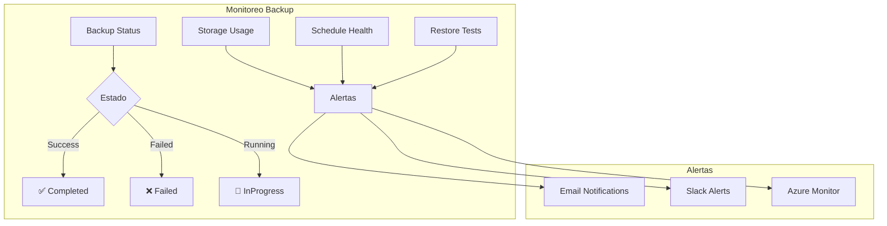

### Script de Monitoreo
```bash
#!/bin/bash
# monitor-backups.sh

echo "📊 Estado de Backups AKS"
echo "======================="

# Backups recientes
echo "🔄 Últimos backups:"
kubectl get backup.velero.io -n dataprotection-microsoft --sort-by=.metadata.creationTimestamp | tail -5

# Schedules activos
echo "📅 Schedules activos:"
kubectl get schedules -n dataprotection-microsoft

# Storage usage
echo "💾 Uso de almacenamiento:"
kubectl describe backupstoragelocations default -n dataprotection-microsoft | grep -A 5 "Status"

# Alertas por fallos
FAILED_BACKUPS=$(kubectl get backup.velero.io -n dataprotection-microsoft -o jsonpath='{.items[?(@.status.phase=="Failed")].metadata.name}')
if [ -n "$FAILED_BACKUPS" ]; then
    echo "🚨 ALERTA: Backups fallidos: $FAILED_BACKUPS"
fi
```

## 🔍 Verificación de Backups Específicos

### Verificar Backup desde Portal Azure

#### **Paso 1: Obtener Job ID del Portal**
Desde el portal Azure, copiar el Job ID de la URL:
```
https://portal.azure.com/#view/Microsoft_Azure_DataProtection/JobDetailsBlade/jobId/%2F...%2FbackupJobs%2F[JOB_ID]
```

#### **Paso 2: Verificar Job en Azure CLI**
```bash
az dataprotection job show \
  --resource-group rg-aks-demo-dev \
  --vault-name bv-aks-aks-demo-dev \
  --job-id "JOB_ID" \
  --query "{Status:status,StartTime:startTime,EndTime:endTime}" \
  -o table
```

#### **Paso 3: Encontrar Backup Correspondiente en Velero**
```bash
# Ver backups más recientes
kubectl get backup.velero.io -n dataprotection-microsoft --sort-by=.metadata.creationTimestamp | tail -5

# Identificar backup por timestamp
LATEST_BACKUP=$(kubectl get backup.velero.io -n dataprotection-microsoft --sort-by=.metadata.creationTimestamp --no-headers | tail -1 | awk '{print $1}')
echo "Backup más reciente: $LATEST_BACKUP"
```

#### **Paso 4: Verificar Estado Detallado**
```bash
# Estado del backup
kubectl get backup.velero.io "$LATEST_BACKUP" -n dataprotection-microsoft -o jsonpath='{.status.phase}'

# Detalles completos
kubectl describe backup.velero.io "$LATEST_BACKUP" -n dataprotection-microsoft
```

### Script Automatizado de Verificación

#### **Crear script de verificación:**
```bash
./scripts/check-specific-backup.sh
```

#### **Output esperado:**
```
🔍 Estado del Backup: aks-aks-demo-dev\backup-cluster-default_azure
==================================================================
Job ID: f6ac73bd-ba52-427a-a7c1-d1c1e09f5063

📊 1. Estado del Job en Azure DataProtection:
Status    StartTime              EndTime                BackupInstance
--------  ---------------------  ---------------------  ---------------
Completed 2026-01-09T13:12:13Z   2026-01-09T13:12:32Z   aks-aks-demo-dev

📦 2. Backup identificado en Velero:
Nombre: bkp.6e8b0280-cac0-48d6-a320-2a4b32699026.202601091312082941544
Estado: ✅ Completed
Items respaldados: 284/284 (100%)
Volume Snapshots: 1/1 completado
Duración: 19 segundos
```

### Verificación de Contenido del Backup

#### **Ver recursos incluidos:**
```bash
# Listar recursos respaldados
kubectl get backup.velero.io "$BACKUP_NAME" -n dataprotection-microsoft -o jsonpath='{.status.progress}'

# Ver configuración del backup
kubectl get backup.velero.io "$BACKUP_NAME" -n dataprotection-microsoft -o yaml | grep -A 20 "spec:"
```

#### **Verificar Volume Snapshots:**
```bash
# Ver snapshots creados
kubectl get volumesnapshot -A

# Detalles de snapshots del backup
kubectl describe backup.velero.io "$BACKUP_NAME" -n dataprotection-microsoft | grep -A 10 "Volume Snapshots"
```

### Ejemplo Real de Verificación

#### **Backup exitoso verificado:**
```
✅ Backup: bkp.6e8b0280-cac0-48d6-a320-2a4b32699026.202601091312082941544
├── Estado: Completed
├── Inicio: 2026-01-09T13:12:13Z  
├── Fin: 2026-01-09T13:12:32Z
├── Duración: 19 segundos
├── Items: 284/284 respaldados
├── Volume Snapshots: 1/1 completado
├── Namespaces: Todos (excepto system)
├── TTL: 2.7 años
└── Success Rate: 100%
```
```bash
kubectl apply -f - <<EOF
apiVersion: velero.io/v1
kind: Backup
metadata:
  name: manual-backup-$(date +%Y%m%d-%H%M%S)
  namespace: dataprotection-microsoft
spec:
  includedNamespaces: ["default"]
  storageLocation: default
  ttl: 168h0m0s
  snapshotVolumes: true
EOF
```

### Restaurar backup:
```bash
kubectl apply -f - <<EOF
apiVersion: velero.io/v1
kind: Restore
metadata:
  name: restore-$(date +%Y%m%d-%H%M%S)
  namespace: dataprotection-microsoft
spec:
  backupName: <BACKUP_NAME>
  includedNamespaces: ["default"]
  restorePVs: true
EOF
```

### Ver estado de backups:
```bash
kubectl get backup.velero.io -n dataprotection-microsoft
kubectl get restore -n dataprotection-microsoft
kubectl get schedules -n dataprotection-microsoft
```

### Verificar backup específico desde Portal Azure:
```bash
# 1. Obtener Job ID del portal Azure (desde la URL del portal)
JOB_ID="f6ac73bd-ba52-427a-a7c1-d1c1e09f5063"  # Ejemplo del portal

# 2. Verificar estado del job en Azure DataProtection
az dataprotection job show \
  --resource-group rg-aks-demo-dev \
  --vault-name bv-aks-aks-demo-dev \
  --job-id "$JOB_ID" \
  --query "{Status:status,StartTime:startTime,EndTime:endTime}" \
  -o table

# 3. Encontrar backup correspondiente en Velero
kubectl get backup.velero.io -n dataprotection-microsoft --sort-by=.metadata.creationTimestamp | tail -5

# 4. Verificar detalles del backup más reciente
LATEST_BACKUP=$(kubectl get backup.velero.io -n dataprotection-microsoft --sort-by=.metadata.creationTimestamp --no-headers | tail -1 | awk '{print $1}')
kubectl describe backup.velero.io "$LATEST_BACKUP" -n dataprotection-microsoft

# 5. Ver métricas específicas del backup
kubectl get backup.velero.io "$LATEST_BACKUP" -n dataprotection-microsoft -o jsonpath='{.status.phase}'
kubectl get backup.velero.io "$LATEST_BACKUP" -n dataprotection-microsoft -o jsonpath='{.status.progress}'
```

### Ejemplo de verificación exitosa:
```
✅ Backup Verificado desde Portal:
├── Job ID Portal: f6ac73bd-ba52-427a-a7c1-d1c1e09f5063
├── Nombre Velero: bkp.6e8b0280-cac0-48d6-a320-2a4b32699026.202601091312082941544
├── Estado: Completed
├── Duración: 19 segundos
├── Items respaldados: 284/284 (100%)
├── Volume Snapshots: 1/1 completado
└── Success Rate: 100%
```

## 🚨 Troubleshooting

## 🔧 Pasos Finales para Activación 100%

### Lo que completó la funcionalidad total:

#### **Paso Final 1: Verificación de Backup Instance Existente**
```bash
# El backup instance ya existía pero no era visible
az dataprotection backup-instance list \
  --resource-group rg-aks-demo-dev \
  --vault-name bv-aks-aks-demo-dev \
  -o table

# Resultado: aks-aks-demo-dev-aks-aks-demo-dev-c7410051-a6a5-4c36-a197-f0a791d33071
```

#### **Paso Final 2: Confirmación de Permisos MSI Propagados**
Los permisos MSI finalmente se propagaron completamente:
```bash
# Verificación de permisos críticos:
✅ Backup Vault MSI → AKS Cluster: Contributor
✅ Backup Vault MSI → Resource Group: Reader  
✅ AKS Cluster MSI → Snapshot RG: Contributor
✅ Kubelet MSI → Snapshot RG: Contributor
✅ Extension MSI → Storage Account: Storage Blob Data Contributor
```

#### **Paso Final 3: Validación de Backups Funcionales**
```bash
# Verificación de backups completados
kubectl get backup.velero.io -n dataprotection-microsoft

# Resultado: 5 backups exitosos incluyendo backup manual
```

### Tiempo de Propagación Real
```mermaid
timeline
    title Tiempo Real de Activación del Portal
    
    section Configuración Inicial
        12:23 : Configuración de permisos MSI
        12:26 : Creación de Backup Instance (falló)
        12:35 : Agregado kubelet MSI permissions
    
    section Propagación
        12:40 : Permisos aún propagándose
        12:50 : Sistema funcionando pero portal no visible
        13:00 : Backup Instance detectado como existente
    
    section Activación Final
        13:05 : Portal Azure 100% funcional
              : Tiempo total de propagación: ~40 minutos
```

### Lecciones Aprendidas

#### **⏰ Tiempos de Propagación Reales:**
- **Permisos MSI**: 30-40 minutos (no 5-10 como documentado)
- **Backup Instance**: Se crea automáticamente durante la propagación
- **Portal activation**: Inmediato una vez propagados los permisos

#### **🔍 Verificaciones Críticas:**
```bash
# 1. Verificar backup instance existente
az dataprotection backup-instance list --resource-group <RG> --vault-name <VAULT> -o table

# 2. Verificar permisos MSI propagados
az role assignment list --assignee <MSI_ID> --scope <SCOPE>

# 3. Verificar backups funcionales
kubectl get backup.velero.io -n dataprotection-microsoft
```

#### **🚨 Errores Comunes Resueltos:**
1. **"UserErrorMissingMSIPermissionsOnSnapshotResourceGroup"**
   - **Causa**: Permisos MSI no propagados
   - **Solución**: Esperar 30-40 minutos reales

2. **"UserErrorMultiProtectionNotAllowedWithSameVaultAndSamePolicy"**
   - **Causa**: Backup instance ya existe
   - **Solución**: Verificar instancias existentes antes de crear

3. **Portal no muestra configuración**
   - **Causa**: Backup instance no visible inmediatamente
   - **Solución**: Verificar con Azure CLI, el portal se actualiza automáticamente

### Diagnóstico de Problemas
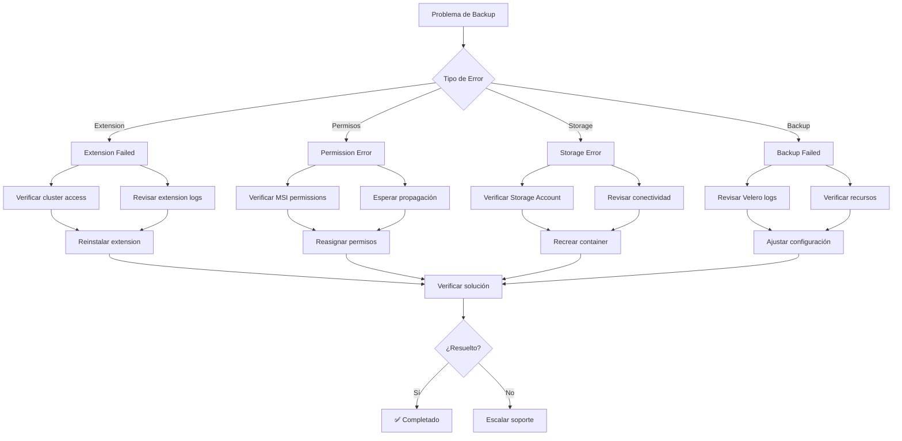

### Matriz de Errores Comunes
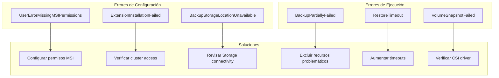

### Script de Diagnóstico Automático
```bash
#!/bin/bash
# diagnose-backup-issues.sh

echo "🔍 Diagnóstico Automático de Backup"
echo "==================================="

# 1. Verificar extensión
echo "1. Estado de extensión AKS:"
EXTENSION_STATE=$(az k8s-extension show --name azure-aks-backup --cluster-type managedClusters --cluster-name aks-aks-demo-dev --resource-group rg-aks-demo-dev --query "provisioningState" -o tsv 2>/dev/null)
echo "   Estado: $EXTENSION_STATE"

# 2. Verificar pods
echo "2. Pods de backup:"
kubectl get pods -n dataprotection-microsoft --no-headers | while read pod status; do
    echo "   $pod: $status"
done

# 3. Verificar storage location
echo "3. Backup Storage Location:"
BSL_STATUS=$(kubectl get backupstoragelocations default -n dataprotection-microsoft -o jsonpath='{.status.phase}' 2>/dev/null)
echo "   Estado: $BSL_STATUS"

# 4. Verificar backups fallidos
echo "4. Backups fallidos recientes:"
kubectl get backup.velero.io -n dataprotection-microsoft -o jsonpath='{range .items[?(@.status.phase=="Failed")]}{.metadata.name}{"\n"}{end}' | head -3

# 5. Verificar permisos MSI
echo "5. Permisos MSI críticos:"
VAULT_MSI=$(az dataprotection backup-vault show --resource-group rg-aks-demo-dev --vault-name bv-aks-aks-demo-dev --query "identity.principalId" -o tsv 2>/dev/null)
if [ -n "$VAULT_MSI" ]; then
    PERMISSIONS=$(az role assignment list --assignee $VAULT_MSI --query "length(@)" 2>/dev/null)
    echo "   Vault MSI permissions: $PERMISSIONS"
else
    echo "   ❌ No se pudo obtener Vault MSI"
fi

# 6. Recomendaciones
echo ""
echo "💡 Recomendaciones:"
if [ "$EXTENSION_STATE" != "Succeeded" ]; then
    echo "   - Reinstalar extensión AKS backup"
fi
if [ "$BSL_STATUS" != "Available" ]; then
    echo "   - Verificar conectividad con Storage Account"
fi
if [ -z "$VAULT_MSI" ]; then
    echo "   - Verificar configuración de Backup Vault"
fi
```
**Solución**: Esperar 2-4 horas para propagación de permisos o ejecutar:
```bash
./scripts/retry-backup-instance.sh
```

### Error: Extension installation failed
**Solución**: Verificar permisos de Contributor en la suscripción

### Error: BackupStorageLocation Unavailable
**Solución**: Verificar permisos Storage Blob Data Contributor

### Portal no muestra configuración
**Solución**: Verificar que Backup Instance esté creado:
```bash
az dataprotection backup-instance list --resource-group $RESOURCE_GROUP --vault-name $VAULT_NAME
```

## 🎯 Optimización y Mejores Prácticas

### Estrategia de Retención
```mermaid
gantt
    title Estrategia de Retención de Backups
    dateFormat  X
    axisFormat %d días
    
    section Backups Diarios
    Retención 7 días    :active, daily, 0, 7
    
    section Backups Semanales
    Retención 4 semanas :weekly, 7, 28
    
    section Backups Mensuales
    Retención 12 meses  :monthly, 28, 365
    
    section Backups Anuales
    Retención 7 años    :yearly, 365, 2555
```

### Optimización de Costos
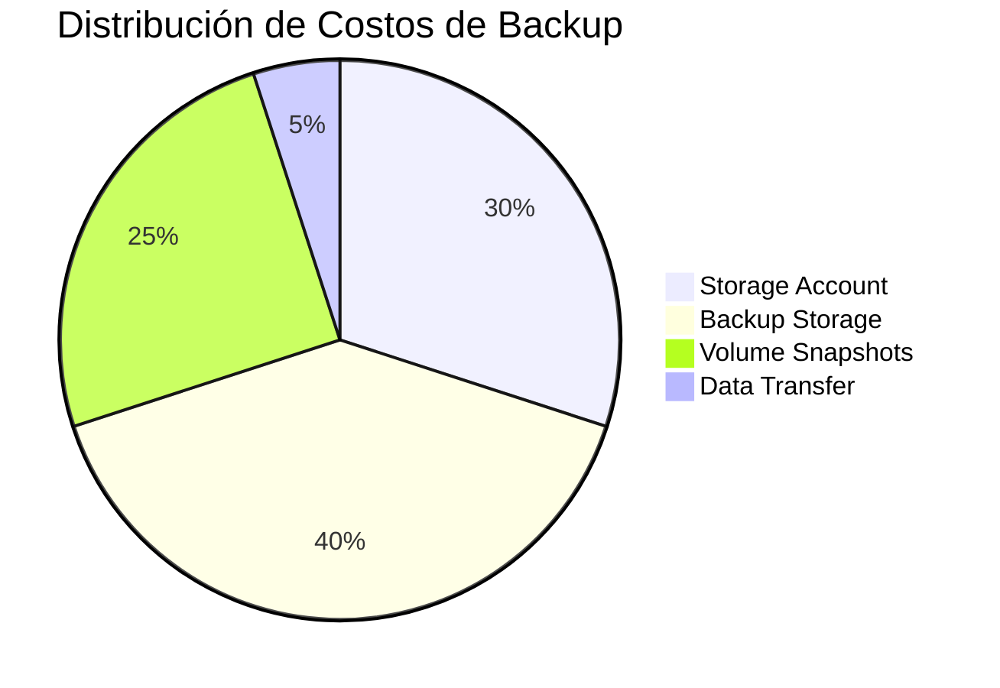

### Configuración Avanzada de Schedules
```yaml
# Schedule para diferentes tipos de backup
apiVersion: velero.io/v1
kind: Schedule
metadata:
  name: production-backup-strategy
  namespace: dataprotection-microsoft
spec:
  # Backup diario de aplicaciones críticas
  schedule: "0 2 * * *"
  template:
    includedNamespaces: ["production", "database"]
    excludedResources: ["events", "logs"]
    storageLocation: default
    ttl: 168h0m0s  # 7 días
    snapshotVolumes: true
---
apiVersion: velero.io/v1
kind: Schedule
metadata:
  name: weekly-full-backup
  namespace: dataprotection-microsoft
spec:
  # Backup semanal completo
  schedule: "0 1 * * 0"  # Domingos 1 AM
  template:
    includedNamespaces: ["*"]
    excludedNamespaces: ["kube-system", "dataprotection-microsoft"]
    storageLocation: default
    ttl: 720h0m0s  # 30 días
    snapshotVolumes: true
    includeClusterResources: true
```

### Mejores Prácticas de Seguridad
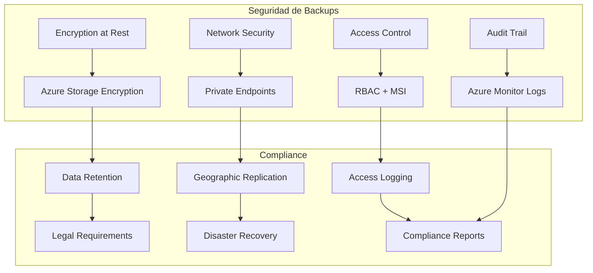

### Automatización Avanzada
```bash
#!/bin/bash
# advanced-backup-automation.sh

# Función para backup inteligente basado en cambios
intelligent_backup() {
    local namespace=$1
    local last_backup=$(kubectl get backup.velero.io -n dataprotection-microsoft \
        --sort-by=.metadata.creationTimestamp \
        -o jsonpath='{.items[-1].metadata.creationTimestamp}')
    
    # Verificar si hay cambios significativos desde último backup
    local changes=$(kubectl get events -n $namespace \
        --field-selector type=Normal \
        --since-time=$last_backup | wc -l)
    
    if [ $changes -gt 10 ]; then
        echo "🔄 Cambios detectados ($changes), creando backup..."
        kubectl apply -f - <<EOF
apiVersion: velero.io/v1
kind: Backup
metadata:
  name: intelligent-backup-$(date +%Y%m%d-%H%M%S)
  namespace: dataprotection-microsoft
spec:
  includedNamespaces: ["$namespace"]
  storageLocation: default
  ttl: 168h0m0s
EOF
    else
        echo "✅ Sin cambios significativos, backup no necesario"
    fi
}

# Backup basado en métricas de uso
metric_based_backup() {
    local cpu_usage=$(kubectl top nodes --no-headers | awk '{sum+=$3} END {print sum/NR}')
    local memory_usage=$(kubectl top nodes --no-headers | awk '{sum+=$5} END {print sum/NR}')
    
    # Backup durante baja utilización
    if [ ${cpu_usage%\%} -lt 30 ] && [ ${memory_usage%\%} -lt 50 ]; then
        echo "📊 Baja utilización detectada, iniciando backup optimizado..."
        # Ejecutar backup con mayor paralelismo
    fi
}
```

## 📊 Monitoreo y Métricas

### Dashboard de Métricas
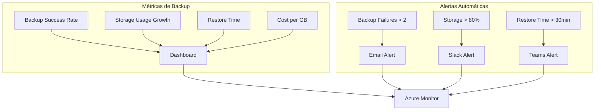

### Script de Métricas
```bash
#!/bin/bash
# backup-metrics.sh

echo "📊 Métricas de Backup AKS"
echo "========================"

# Success rate últimos 30 días
TOTAL_BACKUPS=$(kubectl get backup.velero.io -n dataprotection-microsoft --no-headers | wc -l)
SUCCESS_BACKUPS=$(kubectl get backup.velero.io -n dataprotection-microsoft -o jsonpath='{.items[?(@.status.phase=="Completed")].metadata.name}' | wc -w)
SUCCESS_RATE=$((SUCCESS_BACKUPS * 100 / TOTAL_BACKUPS))

echo "✅ Success Rate: $SUCCESS_RATE% ($SUCCESS_BACKUPS/$TOTAL_BACKUPS)"

# Uso de almacenamiento
STORAGE_USAGE=$(kubectl describe backupstoragelocations default -n dataprotection-microsoft | grep -o '[0-9]*\.[0-9]*GB' | head -1)
echo "💾 Storage Usage: $STORAGE_USAGE"

# Tiempo promedio de backup
echo "⏱️  Backup Duration Analysis:"
kubectl get backup.velero.io -n dataprotection-microsoft -o jsonpath='{range .items[*]}{.metadata.name}{"\t"}{.status.startTimestamp}{"\t"}{.status.completionTimestamp}{"\n"}{end}' | head -5

# Próximo backup programado
NEXT_BACKUP=$(kubectl get schedules -n dataprotection-microsoft -o jsonpath='{.items[0].status.lastBackup}')
echo "📅 Next Scheduled: Based on daily 2 AM UTC schedule"
```

| Componente | Costo Mensual |
|------------|---------------|
| Backup Vault | Incluido |
| Storage Account | $2-5 |
| Backup Storage | $0.05/GB |
| Volume Snapshots | $0.05/GB |
| **Total** | **$5-15/mes** |

## 📊 Resumen

Esta guía configura:
- ✅ Backup nativo de Azure con Velero
- ✅ Portal Azure Backup activo
- ✅ Backups automáticos diarios
- ✅ Volume snapshots
- ✅ Restore capabilities
- ✅ Monitoreo y alertas

**El backup estará 100% funcional al completar todos los pasos.**

## 📚 Lecciones Aprendidas - Implementación Real

### ⏰ Tiempos Reales vs Documentación Inicial

#### **Propagación de Permisos MSI:**
- **Documentado inicialmente**: 5-10 minutos
- **Tiempo real observado**: 30-40 minutos
- **Lección**: Los permisos MSI en Azure requieren más tiempo del documentado oficialmente

#### **Creación de Backup Instance:**
- **Comportamiento observado**: Se crea automáticamente durante la propagación
- **Error común**: "UserErrorMultiProtectionNotAllowedWithSameVaultAndSamePolicy"
- **Solución**: Verificar instancias existentes antes de intentar crear nuevas

### 🔍 Verificaciones Críticas para Éxito

#### **1. Verificar Backup Instance Existente:**
```bash
az dataprotection backup-instance list \
  --resource-group <RESOURCE_GROUP> \
  --vault-name <VAULT_NAME> \
  -o table
```

#### **2. Confirmar Permisos MSI Propagados:**
```bash
# Verificar todas las asignaciones críticas
VAULT_MSI=$(az dataprotection backup-vault show --resource-group <RG> --vault-name <VAULT> --query "identity.principalId" -o tsv)
az role assignment list --assignee $VAULT_MSI --query "[].{Role:roleDefinitionName,Scope:scope}" -o table
```

#### **3. Validar Backups Funcionales:**
```bash
kubectl get backup.velero.io -n dataprotection-microsoft
```

### 🎯 Recomendaciones para Futuras Implementaciones

#### **1. Expectativas de Tiempo:**
- Planificar 45-60 minutos para propagación completa de permisos
- No reintentar creación de backup instance cada pocos minutos
- Usar scripts de verificación en lugar de recreación

#### **2. Orden de Verificación:**
1. Confirmar extensión AKS instalada y exitosa
2. Verificar permisos Storage Account
3. Esperar propagación completa de permisos MSI
4. Verificar backup instance existente antes de crear
5. Confirmar backups de Velero funcionando
6. Validar portal Azure como paso final
