# 🔄 AKS Backup Strategy - AI Enhanced

Documentación completa de la estrategia de backup para Azure Kubernetes Service con optimización IA.

## 🏗️ Arquitectura de Backup

### Componentes Principales


## 🔄 Flujo de Backup Automatizado


## ⏰ Programación de Backup


## 🎯 Tipos de Backup Implementados

### 1. Azure Native Backup


**📚 Referencias:**
- [Azure Backup for AKS](https://docs.microsoft.com/en-us/azure/backup/azure-kubernetes-service-backup-overview)
- [Backup Policies](https://docs.microsoft.com/en-us/azure/backup/backup-azure-kubernetes-service-cluster)

### 2. Volume Snapshots


**📚 Referencias:**
- [Kubernetes Volume Snapshots](https://kubernetes.io/docs/concepts/storage/volume-snapshots/)
- [Azure Disk CSI Driver](https://github.com/kubernetes-sigs/azuredisk-csi-driver)

### 3. Configuration Backup


**📚 Referencias:**
- [Kubernetes Backup Best Practices](https://kubernetes.io/docs/tasks/administer-cluster/configure-upgrade-etcd/#backing-up-an-etcd-cluster)
- [kubectl Reference](https://kubernetes.io/docs/reference/kubectl/)

## 🤖 AI Backup Agent

### Análisis Inteligente


**📚 Referencias:**
- [AI/ML Best Practices](https://docs.microsoft.com/en-us/azure/architecture/data-guide/big-data/machine-learning-at-scale)

## 📋 Paso a Paso Detallado

### Paso 1: Configuración Inicial

```bash
# 1.1 Verificar prerrequisitos
kubectl get storageclass
az extension add --name k8s-extension

# 1.2 Configurar permisos
kubectl create serviceaccount backup-sa
kubectl create clusterrolebinding backup-sa --clusterrole=cluster-admin --serviceaccount=default:backup-sa
```

**📚 Referencias:**
- [AKS Prerequisites](https://docs.microsoft.com/en-us/azure/aks/kubernetes-walkthrough)
- [RBAC Configuration](https://kubernetes.io/docs/reference/access-authn-authz/rbac/)

### Paso 2: Implementar Azure Backup

```bash
# 2.1 Aplicar configuración Terraform
cd environments/dev
terraform apply

# 2.2 Verificar backup vault
az backup vault list --resource-group rg-aks-demo-dev
```

**📚 Referencias:**
- [Terraform AzureRM Provider](https://registry.terraform.io/providers/hashicorp/azurerm/latest/docs)
- [Azure Backup CLI](https://docs.microsoft.com/en-us/cli/azure/backup)

### Paso 3: Configurar Volume Snapshots

```bash
# 3.1 Crear VolumeSnapshotClass
kubectl apply -f - <<EOF
apiVersion: snapshot.storage.k8s.io/v1
kind: VolumeSnapshotClass
metadata:
  name: csi-azuredisk-vsc
driver: disk.csi.azure.com
deletionPolicy: Delete
EOF

# 3.2 Verificar CSI driver
kubectl get pods -n kube-system | grep csi-azuredisk
```

**📚 Referencias:**
- [Volume Snapshot Classes](https://kubernetes.io/docs/concepts/storage/volume-snapshot-classes/)
- [Azure Disk CSI](https://github.com/kubernetes-sigs/azuredisk-csi-driver/blob/master/docs/driver-parameters.md)

### Paso 4: Backup Manual

```bash
# 4.1 Ejecutar backup completo
./scripts/backup-manager.sh backup

# 4.2 Verificar backups creados
./scripts/backup-manager.sh status
```

### Paso 5: Programar Backup Automático

```bash
# 5.1 Configurar CronJob
./scripts/backup-manager.sh schedule

# 5.2 Verificar programación
kubectl get cronjobs
```

**📚 Referencias:**
- [Kubernetes CronJobs](https://kubernetes.io/docs/concepts/workloads/controllers/cron-jobs/)

### Paso 6: Análisis IA

```bash
# 6.1 Ejecutar análisis IA
python3 ai-agents/backup-analyzer/main.py

# 6.2 Análisis completo
./scripts/backup-manager.sh ai-analysis
```

## 💰 Análisis de Costos

### Estructura de Costos

```mermaid
pie title Distribución de Costos de Backup Mensual
    "Backup Vault" : 50
    "Volume Snapshots" : 30
    "Storage" : 15
    "Compute (CronJobs)" : 5
```



### Optimización de Costos

| Componente | Costo Base | Optimizado | Ahorro |
|------------|------------|------------|--------|
| **Backup Vault** | $10/mes | $5/mes | 50% |
| **Snapshots** | $2/GB/mes | $0.05/GB/mes | 97.5% |
| **Retención** | 30 días | 7 días | 77% |
| **Redundancia** | GeoRedundant | LocallyRedundant | 50% |

**📚 Referencias:**
- [Azure Backup Pricing](https://azure.microsoft.com/en-us/pricing/details/backup/)
- [Azure Storage Pricing](https://azure.microsoft.com/en-us/pricing/details/storage/)

## 🔄 Restauración

### Proceso de Restauración


### Comandos de Restauración

```bash
# Restaurar configuraciones
./scripts/backup-manager.sh restore backups/20240108_140000/all-resources.yaml

# Restaurar desde snapshot
kubectl apply -f - <<EOF
apiVersion: v1
kind: PersistentVolumeClaim
metadata:
  name: restored-pvc
spec:
  dataSource:
    name: pvc-snapshot-20240108
    kind: VolumeSnapshot
    apiGroup: snapshot.storage.k8s.io
  accessModes: ["ReadWriteOnce"]
  resources:
    requests:
      storage: 10Gi
EOF
```

**📚 Referencias:**
- [Disaster Recovery](https://kubernetes.io/docs/tasks/administer-cluster/configure-upgrade-etcd/#restoring-an-etcd-cluster)
- [Volume Restore](https://kubernetes.io/docs/concepts/storage/volume-snapshots/#provisioning-volumes-from-snapshots)

## 📊 Monitoreo y Alertas

### Dashboard de Backup


**📚 Referencias:**
- [Azure Monitor](https://docs.microsoft.com/en-us/azure/azure-monitor/)
- [Kubernetes Monitoring](https://kubernetes.io/docs/tasks/debug-application-cluster/resource-usage-monitoring/)

## 🛠️ Comandos de Referencia Rápida

### Backup Operations
```bash
# Estado completo
./scripts/backup-manager.sh status

# Backup manual
./scripts/backup-manager.sh backup

# Análisis IA
python3 ai-agents/backup-analyzer/main.py

# Programar automático
./scripts/backup-manager.sh schedule
```

### Verificación
```bash
# Ver snapshots
kubectl get volumesnapshots --all-namespaces

# Ver CronJobs
kubectl get cronjobs

# Estado de Azure Backup
az backup job list --resource-group rg-aks-demo-dev --vault-name bv-aks-aks-demo-dev
```

### Restauración
```bash
# Listar backups disponibles
ls -la backups/

# Restaurar configuración
./scripts/backup-manager.sh restore <backup-file>

# Restaurar volumen desde snapshot
kubectl apply -f restore-pvc.yaml
```

## 📚 Enlaces de Documentación Oficial

### Azure Documentation
- [Azure Backup for AKS](https://docs.microsoft.com/en-us/azure/backup/azure-kubernetes-service-backup-overview)
- [Azure Backup Pricing](https://azure.microsoft.com/en-us/pricing/details/backup/)
- [Data Protection Backup Vault](https://docs.microsoft.com/en-us/azure/backup/backup-vault-overview)

### Kubernetes Documentation
- [Volume Snapshots](https://kubernetes.io/docs/concepts/storage/volume-snapshots/)
- [Persistent Volumes](https://kubernetes.io/docs/concepts/storage/persistent-volumes/)
- [CronJobs](https://kubernetes.io/docs/concepts/workloads/controllers/cron-jobs/)

### Terraform Documentation
- [AzureRM Provider](https://registry.terraform.io/providers/hashicorp/azurerm/latest/docs)
- [Data Protection Resources](https://registry.terraform.io/providers/hashicorp/azurerm/latest/docs/resources/data_protection_backup_vault)

### Best Practices
- [Kubernetes Backup Best Practices](https://kubernetes.io/docs/tasks/administer-cluster/configure-upgrade-etcd/#backing-up-an-etcd-cluster)
- [Azure Well-Architected Framework](https://docs.microsoft.com/en-us/azure/architecture/framework/)
- [Disaster Recovery Planning](https://docs.microsoft.com/en-us/azure/architecture/framework/resiliency/backup-and-recovery)

---

**🔄 Sistema de backup completamente documentado con IA integrada para optimización automática de costos y estrategias.**
